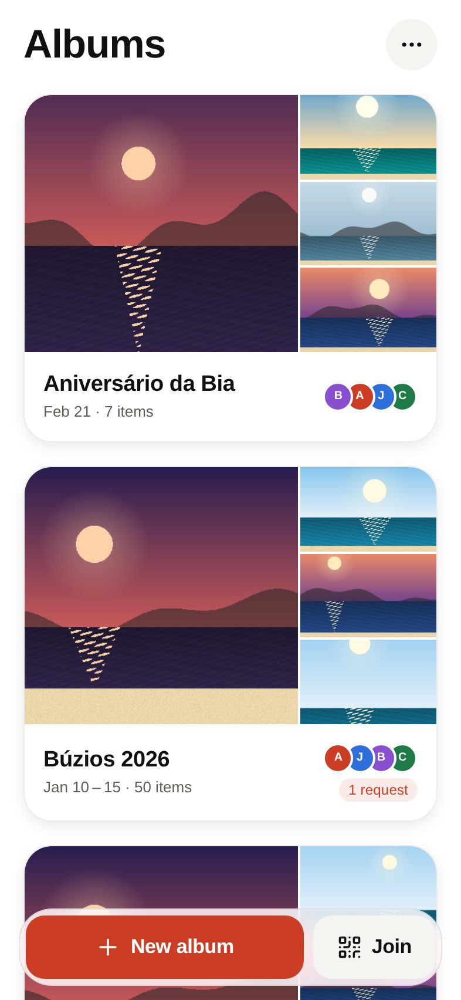
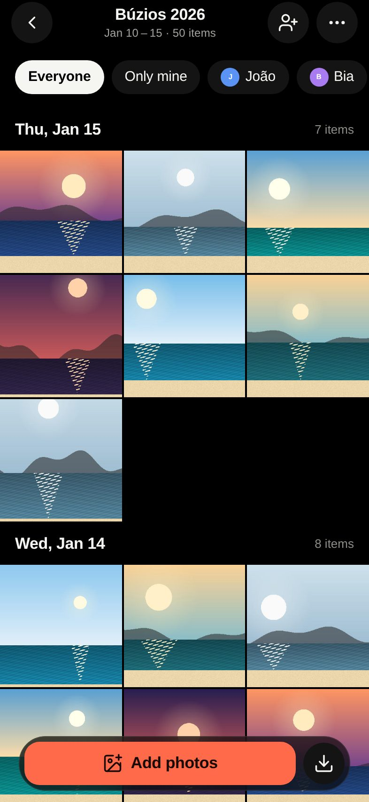
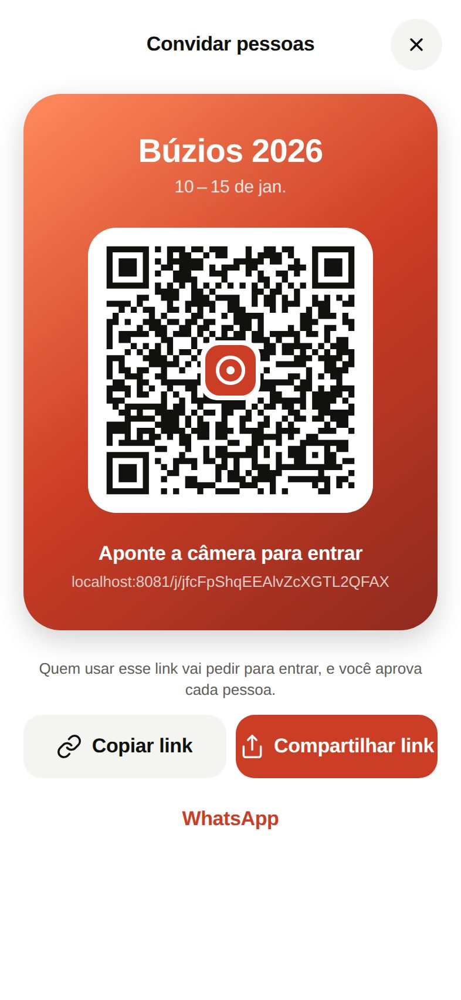

# Rolo: shared photo albums that anyone can join with a link

> Works between iPhone and Android. Nobody needs an account. Everything stays in original quality.

Rolo is a working prototype of private, continuous, shared photo albums, such as "Búzios 2026". One person creates an album and shares a link or QR code in the group chat. Everyone who was there joins in seconds and adds their photos and videos, untouched. Everyone can save everyone else's photos to their phone in original quality.

Rolo is not a social network. There is no feed, no likes and no profiles.

| Light | Dark | Português |
|---|---|---|
|  |  |  |

All key screens are in [`docs/screenshots/`](docs/screenshots) in four sets: light and dark, each in English and Português.

---

## Quick start

### Prerequisites

- **Node 22** and **npm 10+**
- **Docker**, for the local Supabase stack. The Supabase CLI is installed as a dev dependency.
- For the native apps: **Xcode 16+** (iOS 18 simulator or later) and/or **Android Studio** with an emulator (API 34+). The app needs a **development build**, not Expo Go, because it uses native modules for the media library, background tasks, the camera and secure storage.

### 1. Install and configure

```bash
npm install
cp .env.example .env          # local defaults work as-is
```

### 2. Start the backend and load the schema

```bash
npx supabase start            # Postgres, Auth, Storage, Realtime, Mailpit
npx supabase db reset         # applies supabase/migrations/*_init.sql (schema + RLS + storage policies)
npm run seed                  # demo album "Búzios 2026" + friends (optional)
```

> If your network blocks `public.ecr.aws`, pull the same images from Docker Hub instead: `export SUPABASE_INTERNAL_IMAGE_REGISTRY=docker.io` before `supabase start`.

The local Supabase URLs are:
- API: `http://127.0.0.1:54321`
- Mailpit, which receives the 6-digit sign-in codes: `http://127.0.0.1:54324`
- Studio: `http://127.0.0.1:54323`

### 3. Run the app

```bash
npm run ios                   # builds the dev client and opens the iOS simulator
npm run android               # same for the Android emulator
npm run web                   # web fallback (join page + "continue in browser")
```

You don't need to edit `.env` for simulators, emulators or devices on your Wi-Fi. When the configured Supabase URL is `localhost`, the app swaps in the dev machine's LAN address (or `10.0.2.2` on the Android emulator). See `src/config/env.ts`.

### 4. Try it on two devices

1. **Simulator: create an album.** Tap **Create an album**, type a name, then tap **Create**. Open **Invite** to see the QR code and link.
2. **Emulator: join the album** in one of three ways:
   - Open the link: `adb shell am start -a android.intent.action.VIEW -d "rolo://j/<token>"`
   - Scan the QR code with **Join → Scan a QR code**
   - Paste the link into **Join**

   To open the link on iOS instead, use `xcrun simctl openurl booted "rolo://j/<token>"`.
3. **Upload and watch it arrive live.** Add photos on one device; they appear on the other with a "N new from Ana" chip.
4. **Save in original quality.** Open a photo and tap **Save to phone**, or use the bottom bar's **Save all from others**. Files go to a library album with the same name as the shared album.

**Verify that HEIC stays HEIC.**
1. On an iPhone, upload a HEIC photo.
2. On the other device, save it.
3. In Photos, use ⓘ → *Info*: the format, resolution and capture date match the original. Only GPS data is removed, unless the album has **Keep location** on.
4. On the server, `npx supabase` Studio → Storage → `media/albums/<album>/<media>/original.heic` is byte-identical to the original apart from the zeroed GPS block.

To check location stripping on any file, run `npx tsx scripts/strip-location.ts photo.heic`. It's the same code the app uses.

### Demo data

`npm run seed` creates:
- **Búzios 2026**: owner Ana, with João, Bia and Caio; a pending request from Davi; 48 photos and 2 videos spread over Jan 10–15.
- **Aniversário da Bia**: Ana is a member.
- **Réveillon 2027**: Ana's request is pending.

To use Ana's account on a device:
1. Go to **Settings → Account → "Already linked on another phone? Sign in"**.
2. Enter `ana@demo.rolo.app`.
3. Read the code in Mailpit.

`npm run seed:5k` adds a **5,000-item** album for performance testing.

---

## Tests

| Command | What it checks |
|---|---|
| `npm run typecheck` | App and test code (TypeScript strict) |
| `npm test` | Unit tests (21): location stripping (JPEG/HEIC/MOV, also validated on real files), EXIF capture date, upload-queue logic, grid grouping at 5,000 items, i18n parity (keys, placeholders, untranslated strings) |
| `npm run test:server` | **32 server tests** against the local stack, as real anonymous users (details below) |
| `npm run web:serve && npm run e2e:web` | Browser end-to-end tests with independent contexts acting as separate phones (details below) |
| `npm run screenshots` | Captures every key screen in light/dark × EN/PT into `docs/screenshots/` |
| `npm run perf:grid` | 5,000-item grid on web: time to first tiles, frame times during a fast fling |

The **server tests** cover:
- Join, approval, lock, expiry and link reset
- Removing a member, with and without their uploads
- Storage policies: only reserved paths are writable; strangers can't download or sign URLs
- Dedup, quota against the owner, hide, reports, and deleting my data
- Resumable TUS uploads that resume from the server offset

The **browser end-to-end tests** cover:
- Create → share → join → approve live → lock
- Two-person upload with live arrival, the viewer, the filter and multi-select
- GPS stripped and capture date preserved, checked on the server
- Linking an email with a code from Mailpit, then deleting my data

---

## How it's built

### Stack

| Area | Tools |
|---|---|
| App | Expo SDK 57, React Native 0.86, Expo Router, TypeScript |
| Server state | TanStack Query |
| Client state | Zustand, persisted |
| Lists, motion, gestures | FlashList v2, Reanimated 4, Gesture Handler |
| Media | expo-image (thumbhash placeholders), expo-video, expo-media-library, expo-file-system |
| i18n | i18next |
| Backend | Supabase: Postgres + RLS, anonymous Auth, Storage (TUS resumable), Realtime |

```
src/
  app/                 routes (Expo Router)
    j/[token].tsx      join preview (deep link target AND the web fallback page)
    album/[id]/…       grid, share/QR, settings, upload review
  components/ui/       design system primitives (all styling from theme/tokens.ts)
  features/
    albums/  album/    queries/mutations, cards, grid chrome
    upload/            queue store, engine, platform media ops, review screen helpers
    viewer/            full-screen viewer with transitions and gestures
    save/              save originals to the camera roll / web download
    runtime/           long-lived services (engine, network gating, auto-save)
  lib/
    storage/           storageProvider abstraction (+ TUS client), media source hooks
    media/             in-place location stripping, EXIF date, thumbhash, MIME
  i18n/locales/        en.ts (source of truth) + pt-BR.ts (type-checked to match)
  theme/               tokens (color/space/type/radius/elevation/motion), provider
supabase/
  migrations/          schema, RLS, RPCs, storage policies, moderation hook
  templates/           bilingual 6-digit code email
tests/{unit,server,fixtures}
scripts/               seed, e2e, screenshots, perf, strip-location CLI
```

### Identity and access

- **Silent identity.** On first launch the app signs in anonymously. The refresh token is kept in the Keychain or Keystore, split into chunks to fit the Android size limit, and acts as the device token. There are no prompts and no sign-up.
- **Invite tokens** are 144 random bits in url-safe base64. A token lets you:
  - **Preview the album** through the `get_album_preview` RPC. You see the name, creator, member count and blurred thumbhashes, but no pixels and no paths.
  - **Ask to join** through the `join_album` RPC, which checks the token, expiry, lock and join mode.
- **All writes that cross a trust boundary are `SECURITY DEFINER` RPCs.** The `albums`, `album_members` and `media` tables have **no insert or update grants** for clients. RLS covers reads and deletes:
  - Only **active** members read an album, its members or its media.
  - Pending users see only their own membership row, which drives the live waiting screen.
  - Only the uploader or the owner deletes.
- **Storage is a private `media` bucket.** Paths look like `albums/<album>/<media>/{original.ext, thumb.jpg, preview.jpg, live.mov}`. The policies:
  - Members read only what the media table policy lets them see.
  - Uploads are allowed only into paths reserved by `begin_upload` for that user while the row is still uploading.
  - Removing a member cuts access even to their own uploads.
- **Owner controls:**
  - Join mode: open or approval
  - Lock
  - Link expiry (none / 24 h / 48 h / 7 days), computed by the server
  - Reset link
  - Remove a member, keeping or deleting their uploads
  - Keep location
  - Cover photo
  - Hide an item

  Every one of these is enforced on the server and covered by tests.
- **Optional account upgrade** (Settings → Account). Link an email or phone with a 6-digit code. It keeps the same user id, so nothing moves. You can then sign in on another phone. A dismissible nudge appears only after the user is in two or more albums.

### Upload pipeline (original quality)

`src/features/upload/engine.ts` works through a persisted queue, so nothing queued is ever lost.

1. **Stage.** The original comes from the media library: HEIC stays HEIC at full resolution, and videos stay untouched. It is copied into the app's documents folder. The app then:
   - hashes it (native MD5; partial MD5 plus size for files over 64 MB)
   - reads the capture date
   - copies the paired video of a Live Photo
2. **Reserve.** The `begin_upload` RPC checks membership, **dedup** by content hash, and the **owner's quota**. Storage counts against the album owner, and members always contribute for free.
3. **Strip location in place.** Unless the album keeps location, GPS data is removed **without re-encoding or changing any other byte offset**:
   - JPEG: the EXIF GPS block is emptied and XMP `exif:GPS*` values are blanked.
   - HEIC: the `Exif` item is found through the `meta/iinf` and `meta/iloc` boxes and treated the same way.
   - MOV/MP4: `©xyz` and `loci` atoms are retyped to `free`, and ISO 6709 strings are blanked.
4. **Thumbnails.** The client makes a 480 px thumbnail, a thumbhash, and a 1600 px viewer rendition (fast to open, and viewable on web even for HEIC originals).
5. **Upload bytes** with **TUS in 6 MiB chunks**. Each chunk is a native `UploadTask` in an iOS **background URLSession**. After a crash or kill, the upload resumes from the server's offset.
6. **Finalize.** The `finalize_upload` RPC runs the **abuse-scanning hook** (`moderation.scan_media`, a placeholder) before the item becomes visible. Finalizing is idempotent.

The queue has the following behaviour:
- **Bounded concurrency** (2 uploads at a time).
- **Retries** use exponential backoff.
- **Offline or no Wi-Fi.** Uploads wait without burning retry attempts.
- **Quota exceeded.** Items move to *paused* (never dropped). The owner sees the paywall, and uploads resume after an upgrade.
- **Progress pill.** It reads "Uploading 23 of 143" and opens a detail sheet when tapped.
- **Optimistic tiles.** Uploads show in the grid immediately, with a thin progress ring.

### Swapping storage for Cloudflare R2

UI and queue code only use `storageProvider`, defined in `src/lib/storage/types.ts`. An R2 provider would map:

| `storageProvider` method | R2 equivalent |
|---|---|
| `createResumable` | `CreateMultipartUpload`, plus presigned part URLs from a small signing function |
| `uploadChunk` | `PUT` the part, keeping the ETag |
| `getOffset` | `ListParts` |
| `imageSource` and `downloadUrl` | presigned `GET` URLs, or a Worker that checks the Supabase JWT |

The signing function would reuse the same membership checks as the storage policies, through an RPC.

### Design system

All screens use tokens from `src/theme/tokens.ts`:
- A neutral, photo-friendly palette with one coral accent, with light and dark both first-class. Dark mode is true black around photos.
- A type scale with Dynamic Type support (capped).
- A 4-point spacing grid, radii and elevation.
- Motion durations and springs. Every animation collapses when the OS **Reduce Motion** setting is on.

The project uses one outline icon set, Lucide, at one stroke width. Contrast pairs are checked against WCAG AA (ratios are noted in the tokens file). Every control has a screen-reader label, and photos are announced as "Photo by Ana, Jan 12 …".

---

## Platform trade-offs and decisions

- **iOS background uploads.** iOS doesn't run JS freely in the background:
  - The chunk in flight runs in a background `URLSession` and completes even if the app is suspended.
  - The next chunk starts when JS runs, either during background time or when `expo-background-task` wakes the app (the OS decides when, typically every 15 minutes or more).
  - If the app is killed, the queue resumes from the last confirmed TUS offset on the next launch.

  So nothing is lost, but uploads aren't guaranteed to finish while the app stays closed. The upload sheet says so honestly.
- **Android background uploads.** These continue while the process is alive and are resumed by the background task. A foreground service with a notification is the next step for very large batches.
- **Live Photos.** The still and its paired video are both uploaded, and the motion plays on long-press in the viewer. **Saving back to the camera roll as a Live Photo** needs `PHAssetCreationRequest` with paired resources, which Expo doesn't expose, so the still is saved.
- **Smart suggestion** ("Add your 143 photos from Jan 10–15?"). It counts photos only if photo access was **already** granted; the app never shows a permission prompt just to display a suggestion. The review grid comes pre-selected and is fully reviewable.
- **Thumbnails are made on the client.** This keeps the prototype server simple. Production could add a server worker for HEIC and RAW files that come from web uploads.
- **Shared-element transitions:**
  - **Thumbnail → viewer** uses a custom Reanimated transition from the measured thumbnail rect. It works the same on iOS, Android and web, and closes back onto the current photo's thumbnail.
  - **Album card → album** uses Expo Router's native iOS zoom transition on iOS 18+, and a standard push elsewhere.
- **Sharing several items.** The system share sheet takes one file at a time, so multi-select **Share** opens up to five sheets in a row and suggests **Save** beyond that.
- **React Compiler is off.** It memoized reads of module-level caches, such as the web signed-URL cache, and locale-dependent formatting. The hot paths are memoized by hand.
- **Web.** The join page, the album view, basic upload of originals and downloading originals all work in the browser. Browsers can't read the photo library, save into albums, upload in the background or play HEVC video; the web join page points people to the app for those.

## Known limitations

- **No real payments.** The paywall flips the plan through a clearly marked `mock_set_plan` RPC, for the prototype only.
- **No push notifications.** Notifications are local only, and only when uploads finish in the background. `features/notifications/notify.ts` is the single integration point for push.
- **Abuse scanning is a placeholder.** It always allows the item, but the status flow it plugs into (uploading → processing → ready, or hidden) is real.
- **Joining on a second phone that already used Rolo anonymously** signs in to the linked account. Albums that phone joined anonymously aren't merged.
- **Removed members could rejoin with a fresh anonymous account** while the link stays open. The owner's tools for that are **Lock**, **Approval required** and **Reset link**. There's no device fingerprinting, by design.
- **Phone linking** needs a real SMS provider. Locally, `5521999990000` and `5521999990001` sign in with code `123456`, but changing a phone number needs a provider; email linking works fully through Mailpit.
- **Universal links** use the placeholder domain `rolo.app` (`associatedDomains` and an Android intent filter are configured). Production must host `/.well-known/apple-app-site-association` and `assetlinks.json` next to the web build.
- **Live Photo motion** isn't saved to the camera roll (see above).
- **Very large videos on web** are read into memory for location stripping. Native reads them in chunks.
- **Tested environment.** Native builds were checked by bundling iOS and Android with Metro, running `expo prebuild`, and validating config plugins and manifests. The screenshots and end-to-end tests run against the web build. Running on a physical iPhone and Android device is the next validation step.

## Next steps (prioritized)

1. **Real payments.**
   - StoreKit 2 and Play Billing through RevenueCat, with server-side entitlement webhooks that set `profiles.plan`.
   - Remove `mock_set_plan`.
   - Add a family or group plan (several owners pooling storage).
2. **Push notifications.**
   - Expo push tokens stored per device.
   - A Postgres trigger or queue sends "12 new photos from Ana" (batched, quiet hours), plus approval requests for owners and approval results for requesters.
3. **Abuse scanning before visibility.**
   - Replace `moderation.scan_media` with an async worker: CSAM hash matching (PhotoDNA, Thorn Safer or CSAI Match) plus classifiers.
   - Add a review console for the `reports` table, a legal-hold workflow and NCMEC reporting.
4. **Move storage to Cloudflare R2** behind `storageProvider` (presigned multipart; zero egress for "save all").
   - Server-side derived renditions (HEIC/RAW → JPEG previews, video posters and HLS).
5. **Background auto-sync by date range.**
   - Opt-in, per album, Wi-Fi + charging.
   - Watch the media library (`addListener`) and enqueue new captures that fall within the album's dates.
   - Add an Android foreground service for big batches.
6. **Merge anonymous data on sign-in.** Add a signed claim flow so a second phone's anonymous memberships move into the linked account.
7. **Live Photo save** through a small native module (`PHAssetCreationRequest` with paired resources).
8. **Hardening:**
   - Rate limits on `get_album_preview` and `join_album`.
   - Invite-token rotation analytics.
   - Storage garbage collection for orphaned objects.
   - Moving `owner_storage_usage` to an incrementally maintained counter.
